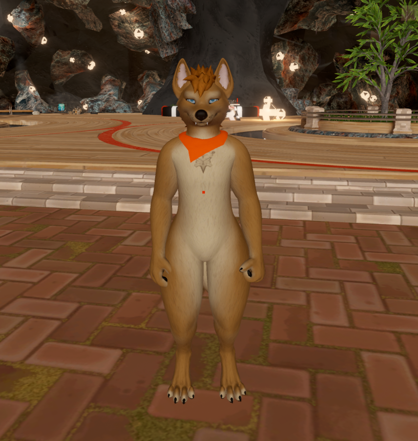
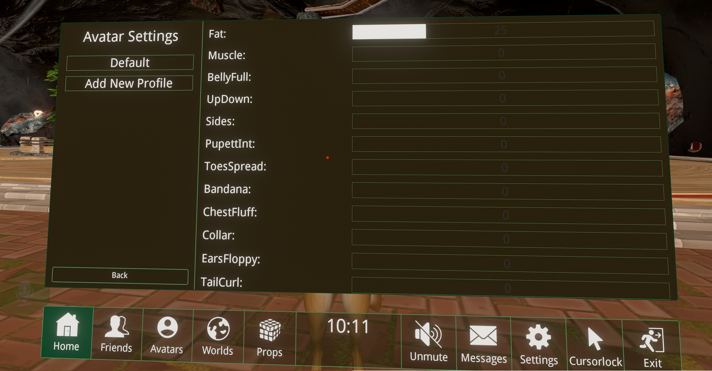

**The latest version of this tool has been tested in Unity but NOT in-game as the ChilloutVR servers are currently down.**

Convert a VRChat SDK3 avatar to ChilloutVR with this Unity script.

Tested with:

- VRChat Avatar SDK3 2022.06.03.00.04
- ChilloutVR CCK 3.3
- Unity 2019.4.31f1

Tested using avatar [Canis Woof by Rezillo Ryker](https://www.vrcarena.com/assets/fnADyoq3IE5b4zIZGanA) (CanineRez_UnityVRC_V011 from July 2022 with PhysBones):

## Video

[Watch video](assets/recording_caniswoof.mp4?raw=true)

## Usage

Go to [Releases](https://github.com/imagitama/vrc3cvr/releases/latest) and expand "Assets" and download the `.unitypackage`.

1. Install the ChilloutVR CCK (FAQ channel in their [Discord](https://discord.gg/ABI))
2. Download and import the vrc3cvr `.unitypackage`
3. Click PeanutTools -> VRC3CVR
4. Select the VRC avatar you want to convert (ensure you have the VRC SDK in the project)
5. Click Convert

Want to convert your PhysBones to DynamicBones? Use these tools:

- https://booth.pm/ja/items/4032295
- https://github.com/Dreadrith/PhysBone-Converter

You don't need to buy DynamicBones! Use this instead: https://github.com/Markcreator/VRChat-Tools

## What does it do?

- adds a ChilloutVR avatar component (if missing)
- sets the face mesh
- sets the visemes
- sets the blink blendshapes
- sets the viewpoint and voice position to the VRChat avatar viewpoint
- adds an advanced avatar setting for each VRChat parameter
  - sliders for all float params
  - toggle for all boolean params
  - dropdown for all int params (toggle if only 1 int found)
- converts each animator controller (gestures, FX, etc.) to support ChilloutVR's gesture system
  - ChilloutVR only supports float parameters so booleans and ints have been converted
  - references to `GestureLeftWeight`/`GestureRightWeight` are converted to `GestureLeft`/`GestureRight` (check your Fist animation!)

## Mapping gestures

Mapping of VRC gestures to CVR:

| Gesture     | VRC | CVR |
| ----------- | --- | --- |
| Nothing     | 0   | 0   |
| Fist        | 1   | 1   |
| Open Hand   | 2   | -1  |
| Point       | 3   | 4   |
| Peace       | 4   | 5   |
| Rock'n'Roll | 5   | 6   |
| Gun         | 6   | 3   |
| Thumbs Up   | 7   | 2   |

### Trigger weight

VRC has two parameters `GestureLeftWeight` and `GestureRightWeight`. They do not exist in CVR and instead check `GestureLeft` amount where 0.5 is 50% of the trigger for the fist animation.

## Avatar compatibility

These avatars have been tested and verified to work in ChilloutVR using the tool. Some have notes for manual steps.

- [x] Canis Woof (Rezillo Ryker)
- [x] Rexouium (Rezillo Ryker)
  - manual step: add missing parameters `ToeMoveH` and `ToeMoveV`
- [x] Awtter (Shade the Bat)
  - manual step: add missing parameter `AFK`
  - fix locomotion: remove the motion in state `WaitForActionOrAFK` in `Actions` controller and enable "Write Defaults"
- [x] Shiba Inu (Alucard/Pikapetey)
- [x] Wickerbeast (Jin A)

Please message via the Discord if you have used the tool on your avatar.

## Ideas for future

- support jaw flap blendshape
- automatically detect jaw/mouth and move voice position
- GestureLeftWeight/GestureRightWeight

## Troubleshooting

### "VRCExpressionParameters.Parameter does not contain a definition for defaultValue" or another VRChat error

Update to a more recent version. Tested with at least VRChat Avatar SDK3 2021.02.23.

### When performing a gesture my hands do not animate

Uncheck "My avatar has custom hand animations" and convert.

### "The type or namespace 'VRC' could not be found"

You need the VRC SDK in your project.
